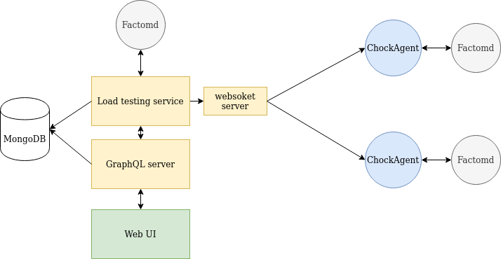

# ChockaBlock

ChockaBlock is a load testing tool for the Factom blockchain.

## Architecture



Technology used:
- Frontend: Vue.js + Vuetify (1.5.x) + Chart.js
- Server: Node.js, GraphQL
- Database: MongoDB
- Agent: Go
- server/agents communication: websocket

This repository contains the code for the GraphQL server, the web frontend UI and the websocket server to communicate with agents. Agent source code can be found [here](https://github.com/PaulBernier/chockagent).

## Deploying ChockaBlock

Have a look at `deploy.sh` script for a basic way to deploy ChockaBlock and at the associated Nginx configs in `doc/nginx-config`.

### Frontend

To build the frontend:
```bash
npm run build
```
The frontend will be built in a `dist` folder. It needs to be moved to `www` folder which is where the server is expecting to serve static assets from.

### Database

ChockaBlock is using MongoDB. It expects it to be on port 27017. We recommend using the MongoDB docker container:

```bash
docker run --name mongodb -p 27017:27017 -d mongo:4.1-bionic
```

See `doc/database.md` for information on the database structure.

### Factomd

A Factomd (testnet) node is expected to run on localhost with its API exposed on port 8088. This node is used to read the block information and also create chains.

### Backend

Some environment variables need to be set before starting:
```bash
EC_ADDRESS=EsXXXXXXXXXXXXXX                                  # EC private address used to create chains
JWT_SECRET=XXXXXXXXXXXXXXX                                   # JWT secret for JWT based authentication (random string)
VUE_APP_GRAPHQL_HTTP=https://chockablock.luciap.ca/graphql   # Apollo GraphQL configs
VUE_APP_GRAPHQL_WS=wss://chockablock.luciap.ca/graphql
```

Then to launch ChockaBlock, using PM2:
```bash
pm2 reload ecosystem.config.js --env production
```

This will serve static files (UI) and GraphQL server on port 4000. Websocket server (for agents to connect to) is on port 4007.

## Development

### Project structure

This is a monorepo containing both frontend and backend. Folder `server` contains backend code (Node.js/GraphQL) and `src` contains the frontend code (Vue.js). See `doc/database.md` for information on the database structure.

### Running the stack locally

Create a file `.env` at the root. Fill it with:
```bash
JWT_SECRET="5902964580"
EC_ADDRESS="Es32PjobTxPTd73dohEFRegMFRLv3X5WZ4FXEwNN8kE2pMDfeMym"
```

You then need to credit the address `EC2vXWYkAPduo3oo2tPuzA44Tm7W6Cj7SeBr3fBnzswbG5rrkSTD` with some EC:
```bash
factom-cli importaddress Fs3E9gV6DXsYzf7Fqx1fVBQPQXV695eP3k5XbmHEZVRLkMdD9qCK
factom-cli buyec FA2jK2HcLnRdS94dEcU27rF3meoJfpUcZPSinpb7AwQvPRY6RL1Q EC2vXWYkAPduo3oo2tPuzA44Tm7W6Cj7SeBr3fBnzswbG5rrkSTD 1000000
```

Now to launch the local stack:
```bash
factomd -network=LOCAL -blktime=60 # Run a local factom network with a 60s block time
docker run --name mongodb -p 27017:27017 -d mongo:4.1-bionic # Start local MongoDB Docker container

npm i # Install dependencies
# Run the following commands in parallel (separate terminals)
npm run serve:backend
npm run serve:frontend
```

`npm run serve:frontend` and `npm run serve:backend` will handle hot reloading both for the frontend and the backend.

ChockaBlock UI is available at http://localhost:4000/ and the GraphQL playground is at http://localhost:4000/graphql.